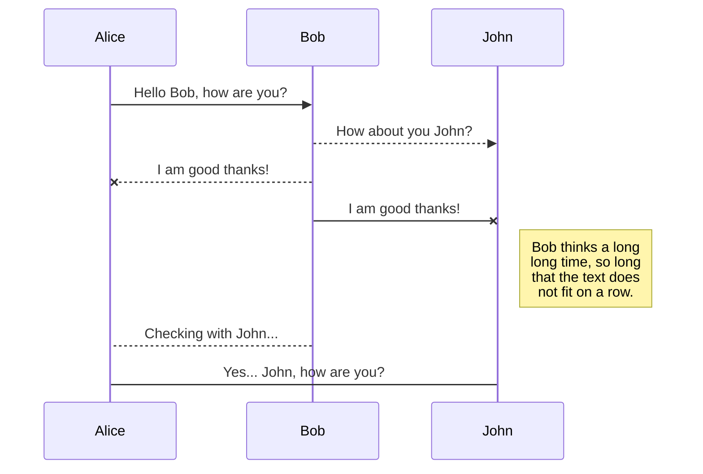
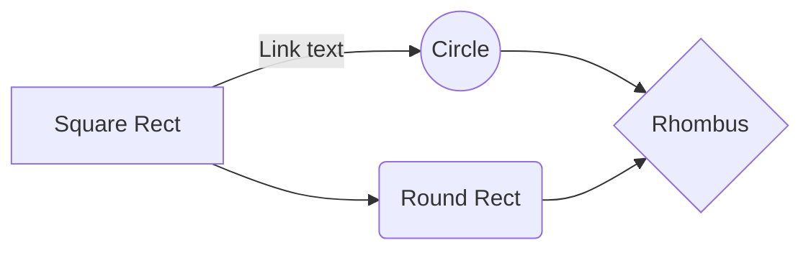

---
title: Try StackEdit
date: 2018-11-05 17:00:00
categories:
  - SoHyun Bae

tags:
  - Markdown
thumbnail:
---

# StackEdit 사용하기
이 글은 StackEdit으로 작성되었다.

**StackEdit**([https://stackedit.io/](https://stackedit.io/app#))은 브라우저에서 마크다운을 읽고, 쓰고, 저장하고, 깃헙으로 발행할 수 있는 오픈소스 웹 어플리케이션.  작성하는 모든 내용이 실시간으로 저장, 동기화된다. 이미지, 인용, 코드, 표, 등등을 작성할 수 있고 LaTeX로 수학식을 쓰거나 다이어그램도 그릴 수 있다.
로컬에 저장되기 때문에 오프라인으로도 사용 가능.

[개발자 깃헙](https://github.com/benweet/stackedit/)에 따르면 다음과 같은걸 할 수 있다.

### StackEdit은:
- 여러 마크다운 파일을 온라인/오프라인으로 관리
- 파일을 마크다운, HTML, PDF, Word, EPUB 등으로 내보내기
- 클라우드에 마크다운파일을 동기화
- 구글 드라이브, 드롭박스, 로컬에 저장된 마크다운을 편집
- 마크다운을 GitHub, Gist, 구글 드라이브, 드롭박스에 발행
- 구글 드라이브와 CouchDB로 워크 스페이스를 공유
 
### 주요 기능:
- 편집창과 미리보기가 스크롤바를 묶어주는 스크롤 싱크로 실시간 HTML 프리뷰
- Markdown Extra/GitHub Flavored Markdown,  Prism.js syntax highlighting 지원
- KaTeX를 이용한 LaTeX 수식 구현
- Mermaid를 이용한 다이어그램과 플로우차트
- [WYSIWYG 컨트롤버튼](https://www.froala.com/wysiwyg-editor/examples/toolbar-buttons) (스크린 사이즈에 맞춰 커스텀화되는 툴바 버튼
- 스마트 레이아웃
- 원클릭 동기화: Blogger, Dropbox, Gist, GitHub, Google Drive, WordPress, Zendesk

  
아래 설명은 StackEdit을 시작하면 기본적으로 저장되어있는 Welcome File을 참고해 간단한 기능 소개를 하려 한다. 자세한 원리가 알고 싶다면 Welcome File에 친절한 설명과 깃헙 링크가 나와있다.

## 동기화

로컬 브라우저에 저장되지만 **구글계정**으로 로그인 하면 다른 브라우저에서도 동기화가 가능하다. 파일을 별도로 관리하고 싶으면 **구글 드라이브** , **드롭박스**, **깃헙** 등에 워크 스페이스를 만들어 저장할 수 있고 모든 수정사항이 실시간으로 동기화된다. 오른쪽의 StackEdit아이콘을 누르면 메뉴가 나온다. 한 계정 안에서 여러개의 워크 스페이스를 만들 수 있음.

사실 계정 하나로 로그인해놓고 브라우저에서 노트하는 걸로만 써와서 워크스페이스는 거의 안 써봤다.  
깃에 바로 퍼블리싱 할 수 있는 기능은 굉장히 유용하다. 레포 내에서의 경로 지정도 가능.

## 툴바

 
기본적인 기능은 다 툴바에 아이콘으로 표시되어있다. 순서대로 **굵게**, **기울이기**, **글자 크기**,**취소선**, **인용**,**표**,**하이퍼링크**,**이미지**. 굳이 아이콘을 이용하지 않아도 **메뉴**의 **마크다운 치트시트**에 친절하게 안내되어 있으니 참고하자.

### + 이미지 첨부하기

   
이미지는 링크로 가져와야하는데 구글포토와 연동하면 구글포토에 업로드한 사진을 가져올 수 있다. 로컬에 있는 이미지를 올리고 싶을 때 구글포토 백업을 사용하면 편리하다. 가끔 이미지 사이즈가 멋대로 조절된다는 단점이 있다.
      
##  편집화면, 미리보기

 편집창 왼쪽에 보이는 아이콘 세 개다. 위에서부터 차례대로 **툴바 접기/펴기**, **미리보기 열기 접기**, **미리보기**.  

### 1. 미리보기

편집한 내용을 미리보기 할 수 있다. 이 기능을 이용하면 StackEdit 내부의 기능을 사용하면서 프리젠테이션 용도로도 사용할 수 있을 듯.

 

### 2. 미리보기 열기 접기
미리보기를 열어서 편집과 미리보기 화면을 보면서 동시에 편집할 수 있다. 이미지를 띄우면 미리보기 창과 스크롤의 차이가 생긴다.  

 
 
접으면 아래처럼 편집창만 보인다. 

## 마크다운 확장기능

 ## SmartyPants
표, 인용, 대쉬. 가장 유용하다.
  

|                |ASCII                          |HTML                         |
|----------------|-------------------------------|-----------------------------|
|Single backticks|`'Isn't this fun?'`            |'Isn't this fun?'            |
|Quotes          |`"Isn't this fun?"`            |"Isn't this fun?"            |
|Dashes          |`-- is en-dash, --- is em-dash`|-- is en-dash, --- is em-dash|

## KaTeX

KaTeX를 이용해 LaTeX의 수학식을 표시할 수 있다. 자세한건 Welcome File와 [KaTeX](https://katex.org/) 참조. 현재 블로그에서는 구현되지 않아서 이미지로 대체한다.

예:

코드:

The *Gamma function* satisfying $\Gamma(n) = (n-1)!\quad\forall n\in\mathbb N$ is via the Euler integral

$$
\Gamma(z) = \int_0^\infty t^{z-1}e^{-t}dt\,.
$$

## UML 다이어그램
아래처럼 모델링을 위한 다이어그램을 그릴 수 있다.  

  
플로우 차트는 아래처럼 그려진다.

[  ] 사각형
((  )) 원형
(   ) 모서리가 둥근 사각형
{   } 마름모

#
별도의 설치 없이 로컬 브라우저에서 편집할 수 있는 훌륭한 툴을 이용하는데에 도움이 되었길 바란다. 유용했다면 오픈소스에게 귀중한 5달러를 기부해도 좋을 듯.       
